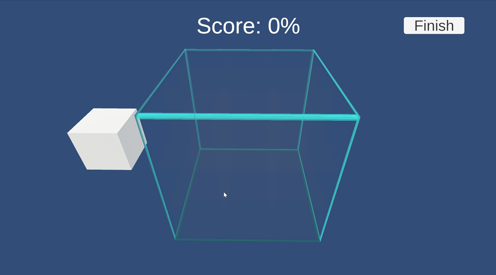

# BlockMatcher

Preview of the project can be found
[here](https://kvartzcode.github.io/BlockMatcher/).

Something I wipped up in 2 days for a school project.  
The goal is the fill an area with as many blocks as possible.

This game is a still a work in progress, and the idea is that you will be given differently shaped blocks in order to make it harder to fill up the area.